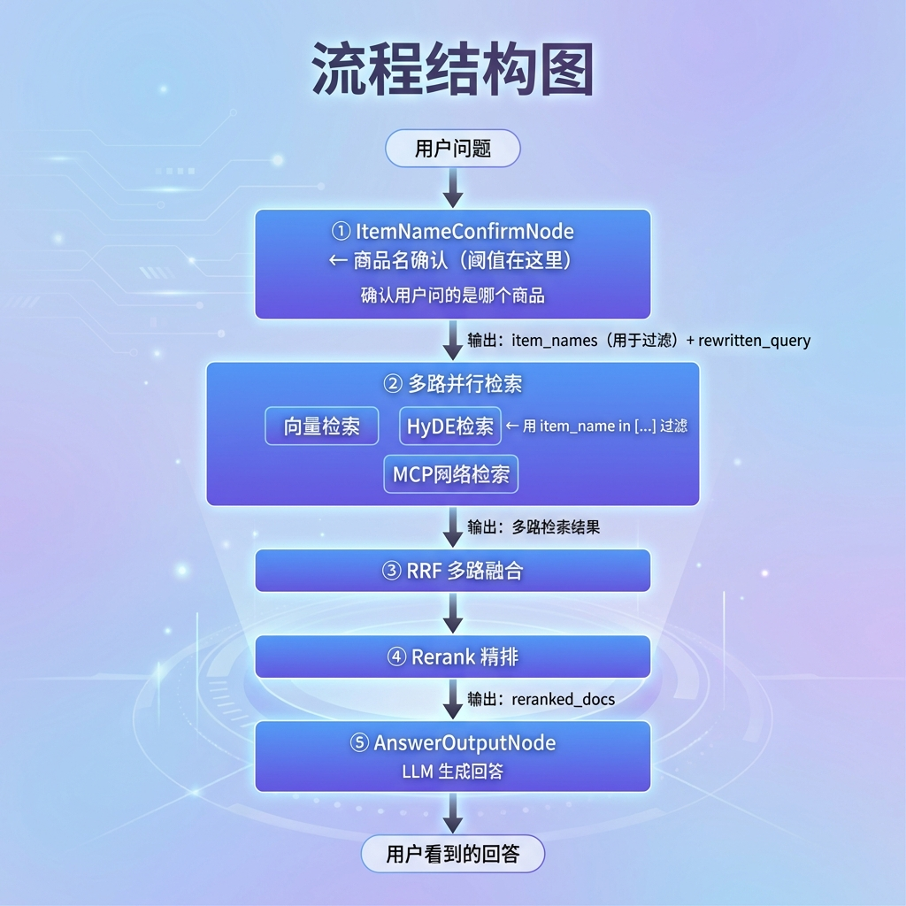
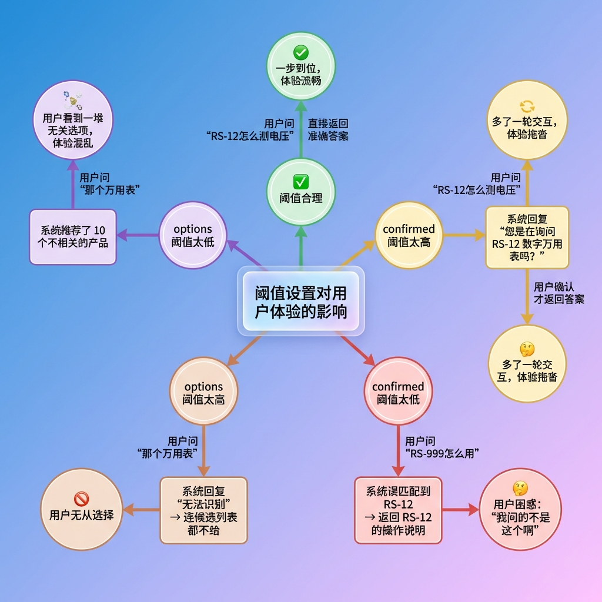
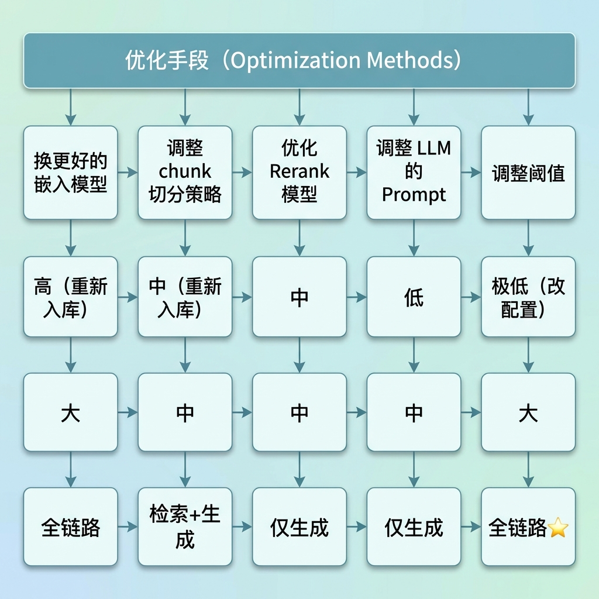
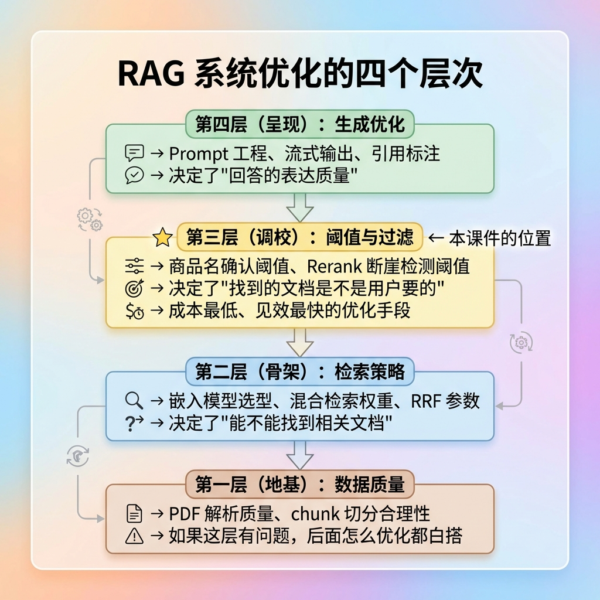
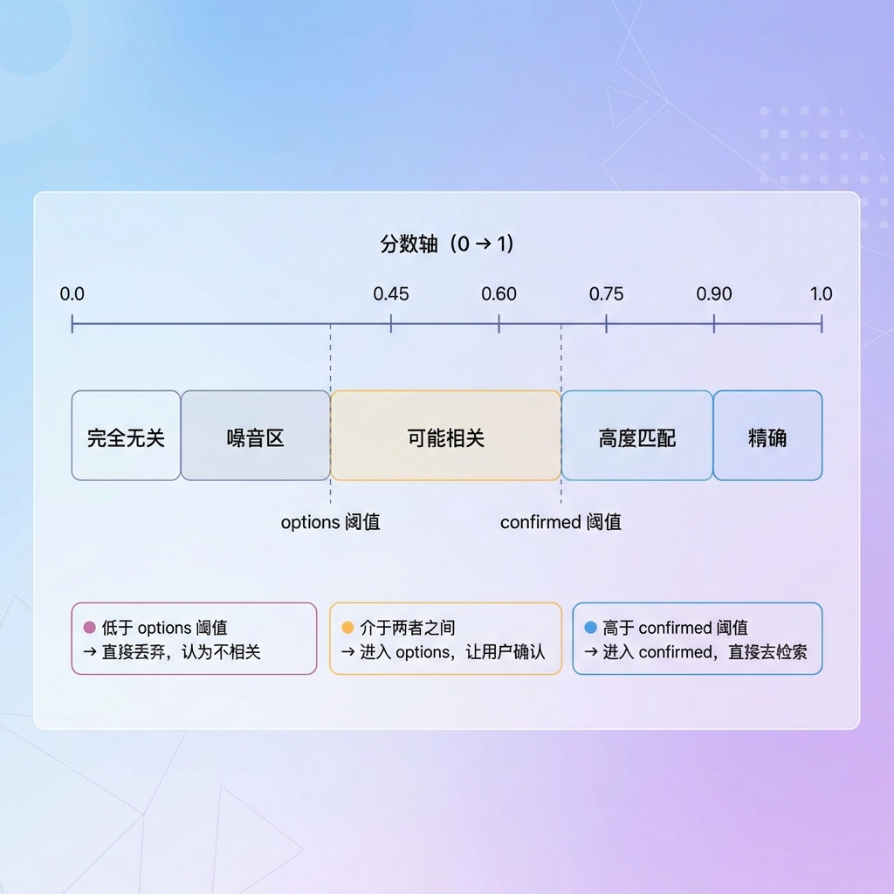
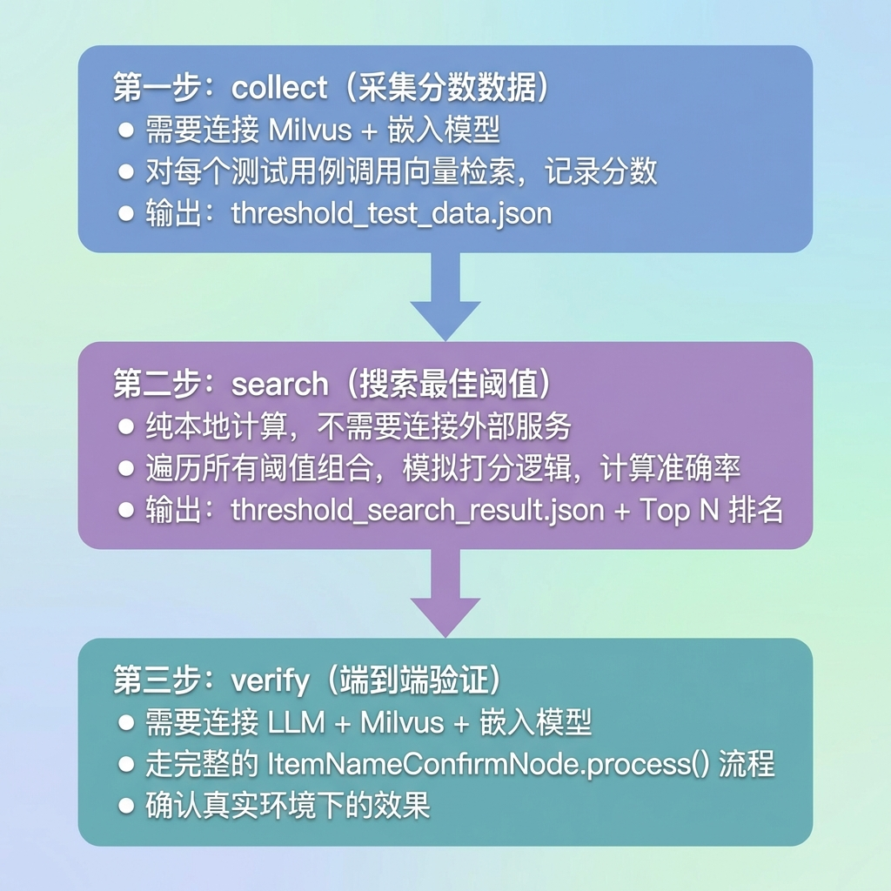
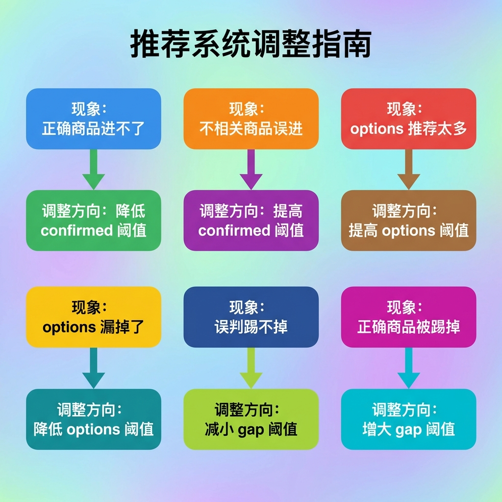

title: 商品名确认阈值微调
category: 大模型知识库
created: 2026-07-02

# RAG项目（查询）—— 商品名确认阈值微调

***

## 1. 任务目标

在智库的查询流程中，`ItemNameConfirmNode` 是第一个节点，负责在检索知识库之前确认用户到底在问哪个商品。它的核心逻辑依赖三个阈值参数来做决策：

```
confirmed 阈值（当前 0.70）：分数超过此值 → 确定是这个商品，直接检索
options 阈值  （当前 0.60）：分数超过此值 → 可能是这个商品，让用户确认
gap 阈值      （当前 0.15）：confirmed 中多个商品的分数差 → 超过此值的踢掉（防误判）
```

本文档的目标是：**通过数据驱动的方式，找到这三个阈值的最优组合**，而不是凭经验拍脑袋。

完成本文档后，你将掌握：

- 阈值微调在 RAG 系统中的定位和影响范围
- 为什么不能直接拍脑袋定阈值
- 阈值测试工具的三步工作流（采集 → 搜索 → 验证）
- 如何设计有效的测试用例
- 如何解读测试结果并修正用例
- 如何将最佳阈值应用到生产环境

***

## 2. 从 RAG 全局视角看阈值微调

### 2.1 查询流程的完整链路

在智库的 RAG 查询流程中，用户的一个问题要经过多个环节才能变成最终的回答：



`ItemNameConfirmNode` 是整条链路的**第一个环节**，它的输出直接决定了后续所有环节的行为。阈值调得好不好，影响的不是一个节点，而是整条链路。

### 2.2 阈值如何影响 RAG 的每一层

**第一层影响：检索范围（向量检索 + HyDE 检索）**

确认了商品名后，下游的向量检索和 HyDE 检索都会加上 `item_name in [...]` 的过滤条件。阈值直接决定了这个过滤条件的内容：

```
阈值太高（如 0.85）→ 大量正确商品进不了 confirmed
  → item_names 为空或进 options
  → 用户被拦截，要求确认
  → 体验差：明明说了"RS-12万用表"还要再确认一次

阈值太低（如 0.55）→ 不相关的商品也进了 confirmed
  → item_names 包含错误的商品名
  → 向量检索用错误的 item_name 过滤
  → 检索到的全是不相关文档
  → RRF、Rerank 再怎么排序也救不回来
  → LLM 基于错误的上下文生成错误的回答
```

**第二层影响：检索质量（RRF + Rerank）**

```
正确的 item_name → 检索范围精准 → 命中的 chunk 相关度高
  → RRF 融合时高分 chunk 占主导
  → Rerank 精排后 Top K 全是高质量文档
  → LLM 生成高质量回答

错误的 item_name → 检索范围偏离 → 命中的 chunk 不相关
  → RRF 融合时全是低分噪音
  → Rerank 精排后 Top K 质量也差（垃圾进垃圾出）
  → LLM 基于不相关内容"编"出看似合理但实际错误的回答
```

**第三层影响：用户体验**



### 2.3 阈值微调的本质：在"精准"和"召回"之间找平衡

从信息检索的角度，阈值微调本质上是在调整 **Precision（精准率）** 和 **Recall（召回率）** 之间的平衡：

```
confirmed 阈值调高 → Precision ↑  Recall ↓
  精准率提高：进入 confirmed 的都是对的
  召回率降低：很多正确的商品过不了阈值，被漏掉

confirmed 阈值调低 → Precision ↓  Recall ↑
  精准率降低：不相关的商品也混进来了
  召回率提高：正确的商品基本都能通过

最佳阈值 → 在当前数据分布下，Precision 和 Recall 的最优平衡点
```

这就是为什么阈值不能拍脑袋定——**最优平衡点取决于你的数据分布**，不同的嵌入模型、不同的商品集合、不同的用户提问方式，平衡点完全不同。

### 2.4 阈值是 RAG 系统中"性价比最高"的优化点



### 2.5 阈值微调在 RAG 优化层次中的位置



阈值微调属于第三层，是在第一层和第二层已经搭好的基础上做精细化调校。它不能解决"数据质量差"或"嵌入模型不行"的根本问题，但它能在现有条件下把效果调到最优。

***

## 3. 核心概念

### 3.1 三个阈值的业务含义

用户问了一个问题后，LLM 会提取出商品名关键词，然后拿去 Milvus 的 `kb_item_names` 集合做向量检索，每个匹配结果都有一个相似度分数（0\~1）。三个阈值决定了这些分数如何被"翻译"成业务决策：



### 3.2 gap 阈值的作用

当 confirmed 列表中有多个商品时，gap 阈值用来踢掉"蹭进来"的误判商品：

```
场景：用户问"RS-12万用表怎么测电阻"
LLM 提取出：["RS-12万用表", "万用表测量电阻"]

如果匹配到不同商品：
  "RS-12万用表"     → RS-12 数字万用表       score=0.78  ← 基准
  "万用表测量电阻"   → hak180使用说明书       score=0.71  ← 误判

  gap = 0.78 - 0.71 = 0.07 < 0.08 → 不踢掉（gap 阈值太小）
  gap = 0.78 - 0.71 = 0.07 < 0.15 → 踢掉（gap 阈值合理）
```

### 3.3 为什么不能拍脑袋定阈值

以我们项目的实际数据为例：

```
分数分布概览：
  [0.9, 1.0)    0 个              ← 没有一个超过 0.9
  [0.8, 0.9)    0 个              ← 也没有超过 0.8
  [0.7, 0.8)   17 个  █████████   ← 正确匹配集中在这里
  [0.6, 0.7)    8 个  ████        ← 模糊区
  [0.5, 0.6)    0 个              ← 天然断裂带
  [0.0, 0.5)   50 个  █████████   ← 噪音区

  最高分: 0.7861, 最低分: 0.3286
```

如果不看数据，直接把 confirmed 阈值设成 0.85，那所有商品都匹配不上，系统永远在让用户确认。**阈值必须根据实际分数分布来定。**

### 3.4 三个阈值之间的约束关系

```
必须满足:  options 阈值 < confirmed 阈值
间距不能太小:  confirmed - options >= 0.05

gap 阈值的范围:  通常在 0.05 ~ 0.25 之间
（太小：正常的商品也被踢掉）
（太大：误判的商品踢不掉，形同虚设）
```

***

## 4. 测试工具架构

### 4.1 整体三步走流程



### 4.2 文件结构

```
knowledge/
  test/
    query/
      test_case.py           # 测试用例定义（TEST_CASES 列表）
      test_threshold.py      # 阈值测试工具（ThresholdTester 类）
  threshold_test_data.json   # collect 输出的分数数据
  threshold_search_result.json  # search 输出的最佳参数
```

### 4.3 核心类设计

```
ThresholdConfig（配置类）
├── data_path / result_path / collection_name
├── confirm_range / options_range / gap_range   # 搜索范围
└── top_n                                       # 显示 Top N

ThresholdTester（测试器类）
├── collect(test_cases)        # 第一步：采集
├── search()                   # 第二步：搜索
├── verify(test_cases)         # 第三步：验证
├── _simulate_align()          # 模拟评分对齐逻辑
├── _simulate_filter()         # 模拟分数差过滤逻辑
├── _check_result()            # 判断结果正确性
└── _evaluate_thresholds()     # 用指定阈值评估所有用例
```

***

## 5. 测试用例设计

### 5.1 用例结构

```python
{
    "query": "RS-12数字万用表怎么测电压？",       # 用户原始问题
    "llm_extract": ["RS-12数字万用表"],           # 模拟 LLM 提取的商品名
    "expected_confirmed": ["RS-12 数字万用表"],    # 期望进入 confirmed
    "expected_options": [],                       # 期望进入 options
    "description": "精确-RS-12测电压"
}
```

注意：expected 中的商品名**必须和 Milvus 中实际存储的 item\_name 完全一致**。

### 5.2 用例分类覆盖表

```
┌──────────────────────┬────────┬─────────────────────────────────────────┬─────────────────┐
│  场景类别             │  数量   │  预期效果                                │  示例            │
├──────────────────────┼────────┼─────────────────────────────────────────┼─────────────────┤
│  精确单商品查询        │  4条    │  → confirmed 有值，options 为空          │ RS-12测电压     │
│  （单手册商品 RS-12）  │        │  → 直接确认，无需用户选择                 │ RS-12测电阻     │
│                      │        │                                          │ RS12简称(无横杠)│
│                      │        │                                          │ 名称顺序调换    │
├──────────────────────┼────────┼─────────────────────────────────────────┼─────────────────┤
│  精确指定具体手册      │  1条    │  → confirmed 有值，options 为空          │ hak180安全事项  │
│  （多手册+语义明确）   │        │  → "安全注意事项"明确指向安全手册         │                 │
├──────────────────────┼────────┼─────────────────────────────────────────┼─────────────────┤
│  同产品多手册          │  3条    │  → confirmed 为空，options 有值(2个)    │ hak180怎么使用  │
│  （未指定哪本）        │        │  → 让用户选择：使用说明书/安全手册        │ hak180简称      │
│                      │        │                                          │ 仅"hak180"型号  │
├──────────────────────┼────────┼─────────────────────────────────────────┼─────────────────┤
│  多商品同时查询        │  1条    │  → confirmed 有值 + options 有值        │ RS-12和hak180   │
│                      │        │  → RS-12进confirmed，hak180进options    │ 对比            │
├──────────────────────┼────────┼─────────────────────────────────────────┼─────────────────┤
│  模糊/描述性查询       │  2条    │  → confirmed 为空，options 有值          │ "RS型号万用表"  │
│                      │        │  → 描述模糊，给出候选让用户确认           │ "hak开头安全"   │
├──────────────────────┼────────┼─────────────────────────────────────────┼─────────────────┤
│  无关查询             │  2条    │  → confirmed 和 options 都为空          │ "店里有什么"    │
│  （无具体商品）        │        │  → LLM无法提取商品名，触发"无法识别"      │ "如何选万用表"  │
├──────────────────────┼────────┼─────────────────────────────────────────┼─────────────────┤
│  不存在的商品          │  2条    │  → confirmed 和 options 都为空          │ RS-999(不存在)  │
│                      │        │  → 向量检索分数过低，无法匹配             │ abc123(不存在)  │
├──────────────────────┼────────┼─────────────────────────────────────────┼─────────────────┤
│  边界情况             │  1条    │  → confirmed 为空，options 有值          │ 仅"RS-12"型号   │
│  （单手册商品仅型号）  │        │  → 信息不足，让用户确认是不是这个商品     │                 │
└──────────────────────┴────────┴─────────────────────────────────────────┴─────────────────┘

总计：15 条测试用例
```

**四种预期效果分布**：

```

┌───────────────────────────────────────────────────────────────────┐
│  预期效果                        │  用例数  │  占比   │  业务含义      │
├───────────────────────────────────────────────────────────────────┤
│  confirmed 有值 + options 为空    │   5条    │  33%    │  直接确认检索  │
│  confirmed 为空 + options 有值    │   6条    │  40%    │  让用户选择    │
│  confirmed 有值 + options 有值    │   1条    │   7%    │  混合场景      │
│  两者都为空                       │   4条    │  27%    │  无法识别      │
└───────────────────────────────────────────────────────────────────┘

```

**覆盖的商品及其手册情况**：

| 商品           | 手册数量 | 测试覆盖场景                       |
| :----------- | :--- | :--------------------------- |
| RS-12 数字万用表  | 1本   | 精确查询、简称、顺序调换、仅型号边界           |
| hak180使用说明书  | 2本   | 未指定→进options                 |
| hak180产品安全手册 | 2本   | 指定安全→进confirmed，未指定→进options |
| 不存在商品        | -    | RS-999、abc123（验证不误匹配）        |

### 5.3 同产品多手册的处理原则

```
原则：用户问得不够精确 → 让用户选择，不替用户猜

"hak180怎么用"       → options（不知道该去哪本手册找）
"hak180的安全注意事项" → confirmed（语义明确指向安全手册）
```

***

## 6. 实操步骤

### 6.1 第一步：采集分数数据

```bash
python -m knowledge.test.query.test_threshold collect
```

关键观察点：正确匹配集中在哪个区间、噪音在哪、有没有断裂带、最高分是多少。

### 6.2 第二步：搜索最佳阈值

```bash
python -m knowledge.test.query.test_threshold search
```

解读 Top 10：如果准确率都一样说明 gap 影响不大；如果低于 70% 先检查用例是否有问题。

### 6.3 分析失败用例

```
┌────────────────────────┬──────────────────────────────────────┐
│  失败原因               │  对策                                │
├────────────────────────┼──────────────────────────────────────┤
│  expected 和实际不一致   │  跑 collect 看实际值，修正用例        │
│  分数卡在阈值边界        │  调整期望（改为进 options）           │
│  嵌入模型区分度不够      │  标记为已知问题，增加商品稀释          │
└────────────────────────┴──────────────────────────────────────┘
```

### 6.4 第三步：端到端验证

```bash
python -m knowledge.test.query.test_threshold verify
```

注意：verify 用真实 LLM 提取，结果可能和 search（手动 llm\_extract）略有不同。

***

## 7. 穷举搜索原理

### 7.1 搜索空间

```python
confirm_range = [0.60, 0.65, 0.70, 0.75, 0.80, 0.85]  # 6 个
options_range = [0.45, 0.50, 0.55, 0.60, 0.65]         # 5 个
gap_range     = [0.08, 0.10, 0.12, 0.15, 0.18, 0.20, 0.25]  # 7 个
# 跳过 options >= confirm 后约 189 种组合，毫秒级完成
```

### 7.2 正确性判断规则

- confirmed：期望的每一个都必须在实际中（不允许少，允许多）
- confirmed：期望为空但实际不为空 → 算错
- options：只在期望非空时检查（允许多出来）

***

## 8. 生产环境的阈值管理

### 8.1 配置化改造

```python
# config.py — 从配置读取，不再硬编码
class QueryConfig:
    item_name_confirm_threshold: float = 0.75
    item_name_options_threshold: float = 0.45
    item_name_gap_threshold: float = 0.08
```

### 8.2 调整方向参考



### 8.3 持续优化循环

```
上线运行 → 收集日志 → 发现问题 → 补充测试用例
    → 重新跑 collect + search → 更新配置上线 → 回到第一步
```

***

## 9. 本次微调总结

### 9.1 迭代过程

```
初始:  confirm=0.70, options=0.60, gap=0.15 → 拍脑袋
第一轮: 准确率 52.9% → 用例有矛盾
第二轮: 准确率 81.2% → 最终结果
```

### 9.2 最终阈值

```
confirm: 0.75（↑ 从 0.70，减少误匹配）
options: 0.45（↓ 从 0.60，利用断裂带）
gap:     0.08（↓ 从 0.15，更严格过滤）
```

### 9.3 已知局限

1. RS12（无横杠）score=0.7057 < 0.75，嵌入模型对符号敏感
2. RS-999 误匹配 RS-12，商品太少导致"向量聚集"
3. 测试用例仅 16 条，后续需补充更多商品重新调参

***

## 10. 命令速查

```bash
python -m knowledge.test.query.test_threshold collect           # 采集
python -m knowledge.test.query.test_threshold search            # 搜索
python -m knowledge.test.query.test_threshold search --top 20   # Top 20
python -m knowledge.test.query.test_threshold verify            # 验证
```

