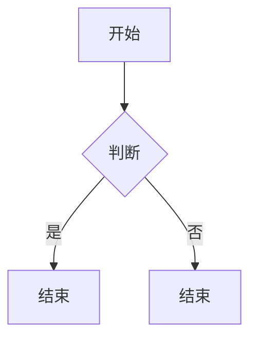

# Markdown 完整语法速查（高效写文档专用）

## 一、标题（6 级，最快排版大纲）

### 两种写法

1. `#` 井号法（推荐，统一规范）

```md
# 一级标题
## 二级标题
### 三级标题
#### 四级标题
##### 五级标题
###### 六级标题

```

1. 底线简写（仅 1、2 级）

```md
一级标题
===

二级标题
---

```

## 二、文本基础样式

```md
**加粗文字**
*斜体文字*
***加粗斜体***
~~删除线~~
==高亮标记==
<u>下划线</u>
行内代码：`print("hello")`

```

效果：**加粗** *斜体* ***粗斜*** ~~删除~~ == 高亮 == 下划线 `代码`

## 三、段落、换行、分割线

1. 换行：行末尾加**两个空格**再回车
2. 分段：空一行
3. 分割线（三种等价）

```md
---
***
___

```

## 四、列表（写清单、需求、步骤最高频）

### 1. 无序列表（- / \* / + 通用）
```md
- 项目1
- 项目2
  - 二级子项（缩进2空格）
  - 二级子项2

```

### 2. 有序列表
```md
1. 第一步
2. 第二步
   1. 子步骤

```

### 3. 任务清单（待办，笔记 / 工作计划神器）
```md
- [x] 已完成任务
- [ ] 未完成任务

```

## 五、引用（摘抄、备注、提示框）

```md
> 一级引用
>> 二级嵌套引用
>>> 三级嵌套引用

```

扩展分段引用：
```md
> 第一段引用
>
> 第二段引用

```

## 六、代码块（开发文档必备）

### 行内代码：`代码`

### 多行代码块（\`\`\` + 语言名 开启语法高亮）

```python
def test():
    print("markdown")

```

支持语言：`java` `sql` `js` `html` `yaml` `bash` `json`

纯文本无高亮：
```plaintext
纯文本内容

```

## 七、表格（数据整理、对比清单）

### 标准表格
```md
| 姓名 | 年龄 | 职业 |
| ---- | ---- | ---- |
| 张三 | 22   | 开发 |
| 李四 | 25   | 产品 |

```

### 对齐控制
```md
| 左对齐 | 居中对齐 | 右对齐 |
| :----- | :------: | -----: |
| aaa    | bbb      | ccc    |

```

## 八、链接 & 图片

### 1. 超链接
```md
[显示文字](https://shturl.cc/j0Dyd "鼠标悬浮提示")
[站内锚点](#一级标题)  # 文档内跳转

```

### 2. 图片
```md


```

### 3. 引用式链接（长文档简化重复链接）
```md
[百度][baidu]
[baidu]: https://www.baidu.com

```

## 九、脚注、注释、锚点

1. 脚注
```md
内容需要标注[^1]
[^1]: 这里是底部注释内容

```

1. 隐藏注释（仅源码可见，不渲染）
```md
<!-- 这里是注释，页面看不到 -->

```

## 十、拓展增强语法（主流编辑器支持：Typora/Vscode/ 语雀 / GitHub）

### 1. 目录自动生成（TOC）
```md
[TOC]

```

### 2. 数学公式（Latex）

行内公式：\\(E=mc^2\\)

块公式：
```math
\sum_{i=1}^n i

```

### 3. 流程图 / Mermaid（技术文档流程图）


### 4. 折叠块（长文档收缩内容）
```md
<details>
<summary>点击展开详情</summary>
这里是隐藏内容
</details>

```

### 5. 表情符号
```md
:check: :x: :warning: :rocket:

```

## 十一、高效编写提速技巧

1. 统一缩进：子列表 / 代码统一 2 空格，格式不乱
2. 分段必空一行，区分层级可读性翻倍
3. 代码块全部指定语言，高亮方便阅读
4. 表格固定模板，复制复用，不用每次重写竖线
5. 大量重复链接使用引用式链接简化文本
6. 长文档顶部放 `[TOC]` 自动目录快速跳转
7. 备注用 html 注释，不干扰正文展示
8. 任务清单替代普通列表，适合工作计划、待办文档

## 十二、常用编辑器快捷键（大幅提升效率）

### VS Code Markdown

- Ctrl+B：加粗
- Ctrl+I：斜体
- Ctrl+/：注释切换
- Ctrl+Shift+V：预览文档

### Typora

- Ctrl+1\~6：快速生成标题
- Ctrl+T：插入表格
- Ctrl+K：插入链接
